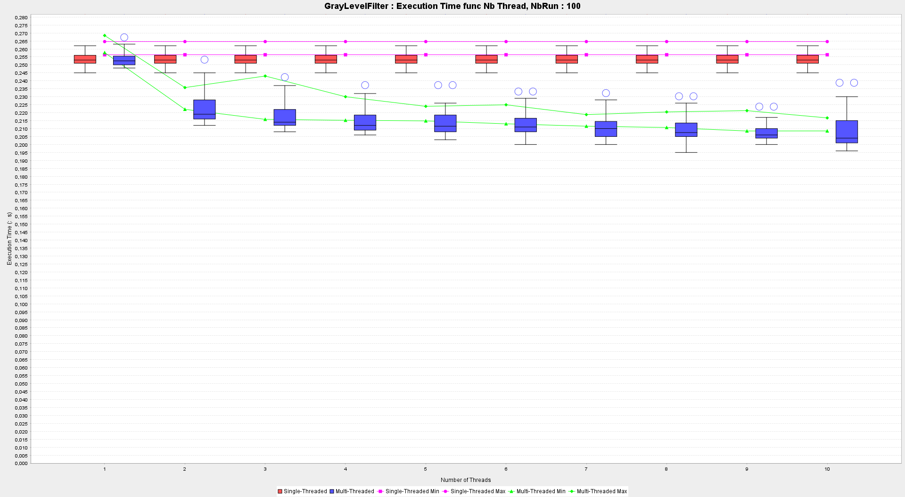
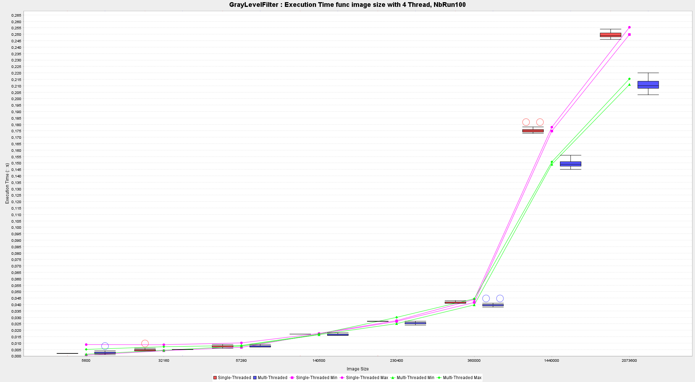
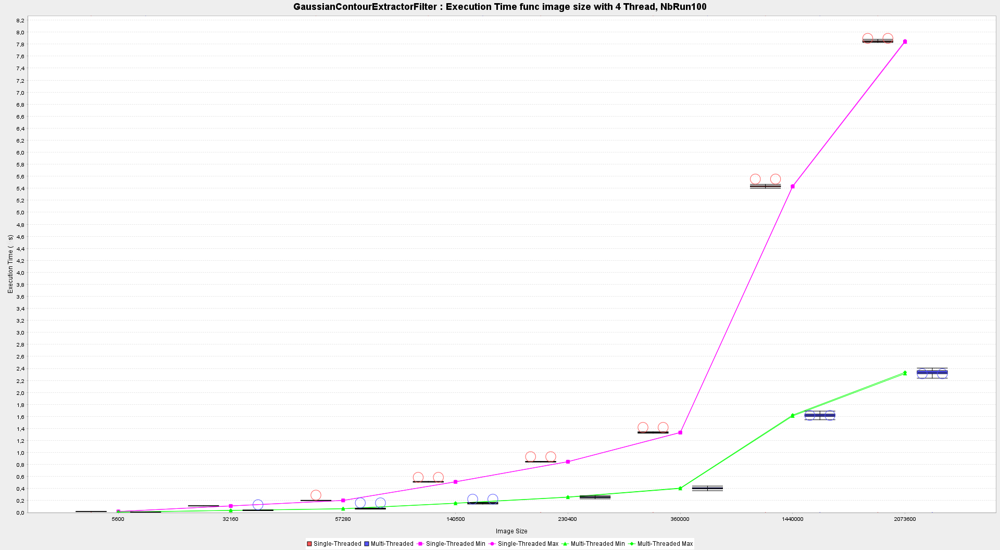

# TP 3-4 de SPP
A java Multithreaded image filtering engine.

# About

This project is a practical session about multiThreading.

Based on a filter interface and a engine interface, we build two kinds of filtering engine :

We first implemented a version of the filtering engine without thread, to demonstrate that this is slow.

Then we implemented the multithreaded version.

The both versions takes the same kind of filters implementing IFilter interface.

# Part I
We were given two interfaces, one for the filtering engine and one for the filters.

> [Filter Interface](./main/java/src/IFilter.java)
> 
> [Engine Interface](./main/java/src/IImageFilteringEngine.java)

## Bonnus
In addition of these interfaces, we developped a new class called FilteringEngineSkeleton
> [Engine class](./main/java/src/FilteringEngineSkeleton.java)

This class will be responsible of all the load, unload of images, capturing execution time, and parameters of the main functions of the engine.

All of our concrete engine will extend this class. [see documentation](https://lumi-git.github.io/TP3_4_SPP/FilteringEngineSkeleton.html)

## Filters
In this part we have implemented the filters based on the implementation described by the [IFilter interface](./main/java/src/IFilter.java)

we've done two filters :

- [Gray level filter](./main/java/src/GrayLevelFilter.java)
- [Gaussian contour filter](./main/java/src/GaussianContourExtractorFilter.java)

The Gray level filter will transform any image in RGB colors, into a output image with only 256 gray level.

The gaussian contour filter will be applied on a gray scaled image, and will output an image in gray scale but with the contour of the objects in the image more prononced.

For more information about the implementation of the filters, see [Subject](ESIR_SPP_TP_3_4_New_2023.pdf).

# Part II

Based as allways on the [FilteringEngineSkeleton class](./main/java/src/FilteringEngineSkeleton.java) we coded a new version of the filtering engine, based on Threading methodes.

Thanks to multiThreading, we will be able to minimize the computation time to filter an image.

To do so, we will separate the image in smaller task, and then give this task to various workers.

As we work with thread, we had to create a new class that will contain all the work that has to be done in one chunk of the image.

This class is called [ApplyingWorker](./main/java/src/ApplyingWorker.java) .

It contains all the data we need to process a chunk of the image. [see documentation](https://lumi-git.github.io/TP3_4_SPP/FilteringEngineSkeleton.html)

The second Point is the use of [Cyclicbarrier](https://docs.oracle.com/javase/8/docs/api/java/util/concurrent/CyclicBarrier.html) in java.

This object will be our way to synchronised our thread along the filtering job :

1) In fact, as we have first to deal with separating the entire job and asigning to workers, we need to wait until the job is separated to start all the workers.
This will be our first synchronisation point.

2) Then after the workers have started, we need to wait until all of them has finish there work to continue. This will be our second synchronisation point.

So, in each of the [Workers](./main/java/src/ApplyingWorker.java) you will find two points of synchronisation, recognizable as awaiting the barrier.

### Rq 
We could use here the "join" methode on the thread to wait.

# Part III

## First experiment

We want to measure the time taken to apply the following filters with sequential and parallel version from 1 to 10 threads:
- GrayLevelFilter
- GaussianContourExtractorFilter

for the sequential version we have made only once the "runs" and we have displayed them as a constant for the different threads going from 1 to 10.
In the diagrams you will see box-and-whisker plots that are slightly shifted from the lying points in order to read them.
They are calculated on all curves. 
Furthermore you can see two purple and two green curves which are respectively the min and 
the max of the confidence interval of the sequential and the parallel.

We can see on this graph that the parallel is slightly better than the sequential. This is due to the fact that the computation time is very short and that most of the time is used to open the images.
Moreover we can see that the confidence interval is very fluctuating and that for some threads the difference is more important (for example thread 3).
This may be due to strong variation on the time of the run. We believe that this disparity will no longer be visible for a larger number of runs

We can see on this graph that the parallel is much better than the sequential in fact there is much more calculation in this filter which allows an improvement up to 571%.
We can see that the confidence interval is very narrow which allows us to conclude that there is such an important improvement.

## Second experiment

We want to measure the time taken to apply the following filters with sequential and parallel (k = 4 threads) on all image 15226222451_*.jpg :
- GrayLevelFilter
- GaussianContourExtractorFilter

This will give us a graph of time versus image size.
In the diagrams you will see box-and-whisker plots that are slightly shifted from the lying points in order to read them.
They are calculated on all curves.
Furthermore you can see two purple and two green curves which are respectively the min and
the max of the confidence interval of the sequential and the parallel.

We can see on this graph that the parallel is slightly better than the sequential.
This is due to the fact that the computation time is very short and that most of the time is used to open the images.
The same effect as in the first experiment is visible here, the confidence interval is very fluctuating and for some images the difference is more important.
This may be due to strong variation on the time of the run. We believe that this disparity will no longer be visible for a larger number of runs.

We can see on this graph that the parallel is much better than the sequential in fact there is much more calculation in this filter which allows an improvement up to 325% for the last image.
We can see that the confidence interval is very narrow which allows us to conclude that there is such an important improvement.
The same effect as in the first experiment is visible here.

# Documentation :
> Generated Javadoc
> https://lumi-git.github.io/TP3_4_SPP/package-summary.html

