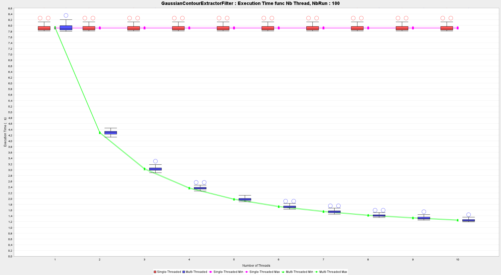

# TP 3-4 de SPP
Multithreaded image filtering engine.

# About

This project is a practical session about multiThreading.

Based on a filter interface and a engine interface, we build two kinds of filtering engine :

We first implemented a version of the filtering engine without thread, to demonstrate that this is slow.

Then we implemented the multithreaded version.

The both versions takes the same kind of filters implementing IFilter interface.

# Part I
# Part II
# Part III

## First experiment

We want to measure the time taken to apply the following filters with sequential and parallel version from 1 to 10 threads:
- GrayLevelFilter
- GaussianContourExtractorFilter

for the sequential version we have made only once the "runs" and we have displayed them as a constant for the different threads going from 1 to 10.
In the diagrams you will see box-and-whisker plots that are slightly shifted from the lying points in order to read them.
They are calculated on all curves. 
Furthermore you can see two purple and two green curves which are respectively the min and 
the max of the confidence interval of the sequential and the parallel.

We can see on this graph that the parallel is slightly better than the sequential. This is due to the fact that the computation time is very short and that most of the time is used to open the images.
Moreover we can see that the confidence interval is very fluctuating and that for some threads the difference is more important (for example thread 3).
This may be due to strong variation on the time of the run. We believe that this disparity will no longer be visible for a larger number of runs

We can see on this graph that the parallel is much better than the sequential in fact there is much more calculation in this filter which allows an improvement up to 571%.
We can see that the confidence interval is very narrow which allows us to conclude that there is such an important improvement.

## Second experiment

We want to measure the time taken to apply the following filters with sequential and parallel (k = 4 threads) on all image 15226222451_*.jpg :
- GrayLevelFilter
- GaussianContourExtractorFilter

This will give us a graph of time versus image size.
In the diagrams you will see box-and-whisker plots that are slightly shifted from the lying points in order to read them.
They are calculated on all curves.
Furthermore you can see two purple and two green curves which are respectively the min and
the max of the confidence interval of the sequential and the parallel.

We can see on this graph that the parallel is slightly better than the sequential.
This is due to the fact that the computation time is very short and that most of the time is used to open the images.
The same effect as in the first experiment is visible here, the confidence interval is very fluctuating and for some images the difference is more important.
This may be due to strong variation on the time of the run. We believe that this disparity will no longer be visible for a larger number of runs.

We can see on this graph that the parallel is much better than the sequential in fact there is much more calculation in this filter which allows an improvement up to 325% for the last image.
We can see that the confidence interval is very narrow which allows us to conclude that there is such an important improvement.
The same effect as in the first experiment is visible here.

# Documentation :
> Generated Javadoc
> https://lumi-git.github.io/TP3_4_SPP/package-summary.html

